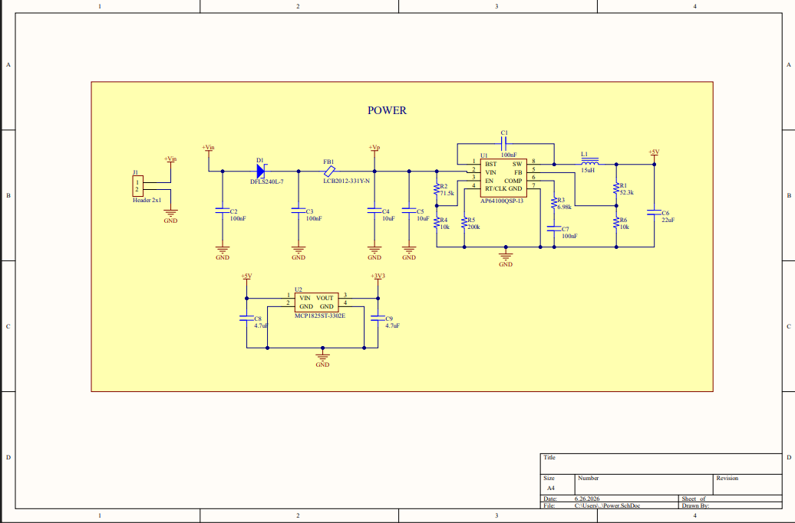
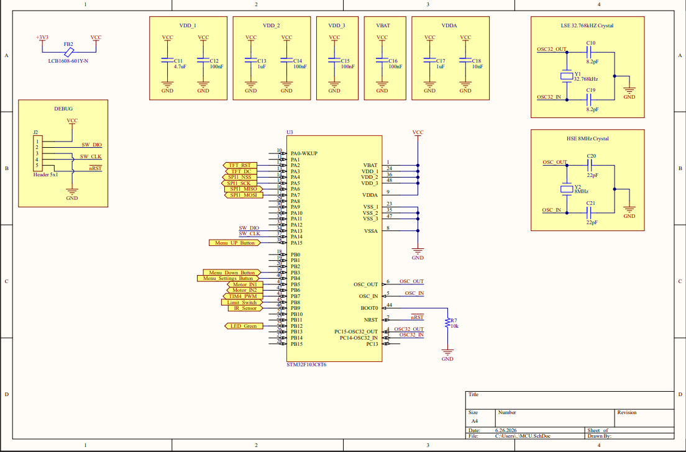
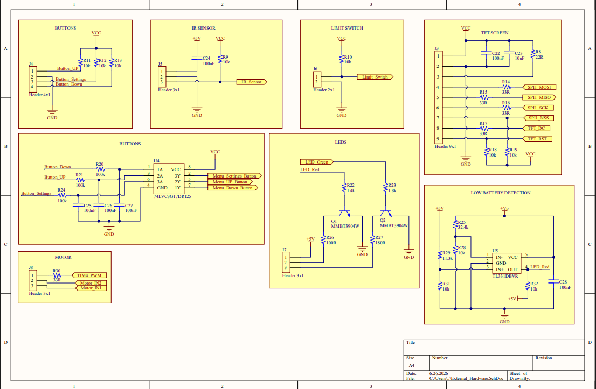
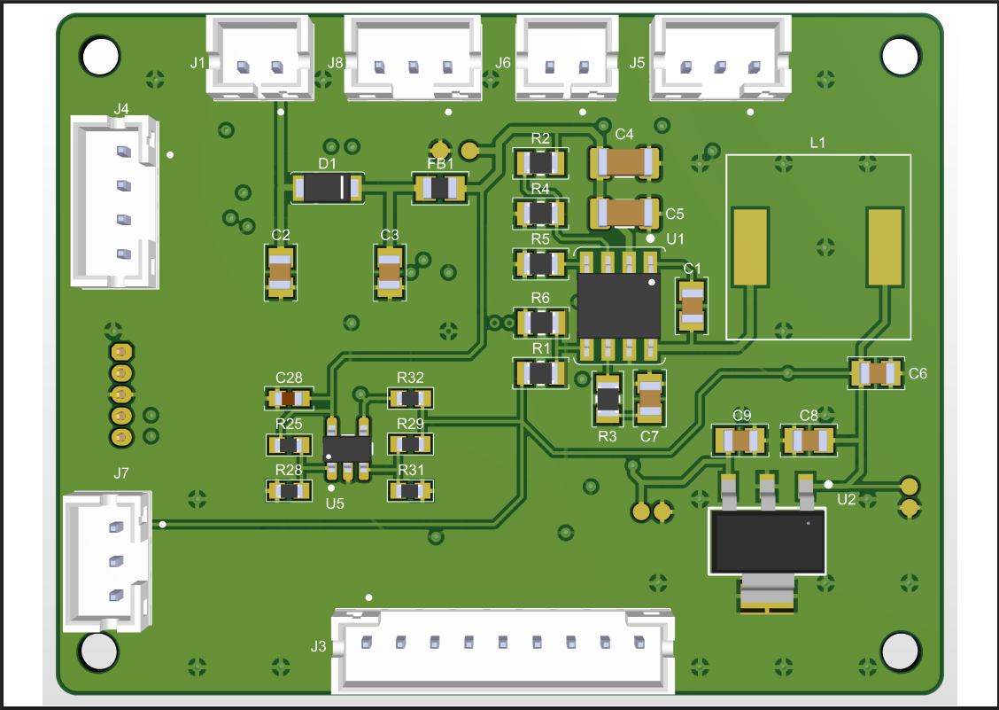
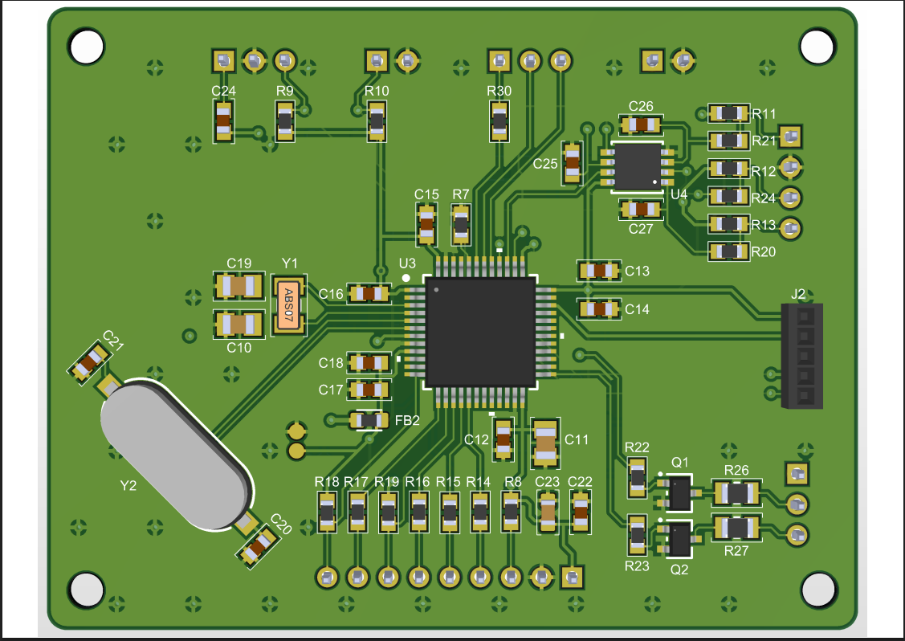

# Otomatik Tavuk Kümesi Kapısı Ana Kontrol Kartı

Bu sunum, **STM32F103C8T6 tabanlı otomatik tavuk kümesi kapısı kontrol kartı** için hazırlanmış donanım tasarım dosyalarını içerir.

Kart; Li-ion pil paketi ile beslenen, kapı motorunu kontrol eden, kapı konumunu limit switch ile takip eden, IR sensör ile varlık algılayan, TFT ekran, panel LED’leri ve panel butonları ile kullanıcıya durum bilgisi sunan gömülü sistem donanımı olarak tasarlanmıştır.

> Bu sunum, ağırlıklı olarak PCB donanım tasarım dosyalarını içerir. Firmware/yazılım geliştirmesi bu depoya dahil değildir.

---

## Proje Özeti

Sistem ana beslemesini **Li-ion pil paketinden** alır. Kart üzerinde gerekli gerilim seviyelerini üretmek için güç dönüştürücü devreler bulunur.

Kart üzerinde bulunan temel donanımlar:

- **Li-ion pil paketi ana besleme girişi**
- **12 V → 5 V buck converter güç katı**
- **5 V → 3.3 V LDO regülatör güç katı**
- **STM32F103C8T6 mikrodenetleyici**
- **Harici 8 MHz HSE kristal**
- **Harici 32.768 kHz LSE kristal**
- **TFT ekran arayüzü**
- **Motor PWM ve yön kontrol çıkışları**
- **Kullanıcı buton girişleri**
- **Panel durum LED çıkışları**
- **Düşük pil algılama devresi**
- **IR varlık/engel sensörü girişi**
- **Kapı tam açık / tam kapalı limit switch girişleri**
- **SWD programlama ve debug bağlantısı**
- **Ana besleme hatları için test point’ler**

Bu kart, otomatik kapı sisteminde MCU’nun motor hareketini yönetmesi, kapı konumunu algılaması, kullanıcı girişlerini okuması ve sistem durumunu ekran/LED üzerinden göstermesi için tasarlanmıştır.

---

## Donanım Blokları

### Güç Devresi

Kartın ana beslemesi Li-ion pil paketidir. Giriş gerilimi önce buck converter ile 5 V seviyesine düşürülür. Ardından 5 V hattından LDO regülatör ile 3.3 V lojik besleme hattı üretilir.

| Hat | Kaynak | Kullanım Amacı |
|---|---|---|
| Pil Girişi | Li-ion pil paketi | Ana sistem beslemesi |
| 5 V | Buck converter | Sensör/periferik beslemesi |
| 3.3 V | LDO regülatör | MCU ve lojik devre beslemesi |

Güç bölümünde giriş filtreleme, koruma elemanları ve regüle çıkış devreleri bulunmaktadır.



---

### Mikrodenetleyici Bölümü

Ana kontrolcü olarak **STM32F103C8T6** kullanılmıştır.

MCU bölümünde bulunan temel yapılar:

- STM32F103C8T6 mikrodenetleyici
- Harici 8 MHz HSE kristal
- Harici 32.768 kHz LSE kristal
- MCU besleme dekuplaj kapasitörleri
- Reset / boot bağlantıları
- SWD programlama ve debug header’ı
- 3.3 V lojik besleme bağlantıları



---

### Harici Donanım Arayüzleri

Kart, otomatik kapı sisteminde kullanılan harici donanımlar için gerekli bağlantı ve kontrol arayüzlerini içerir.

Desteklenen harici bağlantılar:

- TFT ekran bağlantısı
- Motor PWM çıkışı
- Motor yön kontrol çıkışı
- Kullanıcı buton girişleri
- Panel durum LED çıkışları
- IR varlık/engel sensörü girişi
- Kapı tam açık limit switch girişi
- Kapı tam kapalı limit switch girişi
- Pil/düşük gerilim algılama sinyalleri



---

## PCB Görünümleri

### PCB Üst Görünüm



### PCB Alt Görünüm



---

## Depo Yapısı

```text
.
├── Design_Files/
│   ├── Chicken_Coop_Door_Main_Board_V3.PcbDoc
│   ├── Chicken_Coop_Door_Main_Board_V3.PrjPcb
│   ├── Chicken_Coop_Door_Main_Board_V3.PrjPcbStructure
│   ├── Power.SchDoc
│   ├── MCU.SchDoc
│   └── External_Hardware.SchDoc
│
├── Images/
│   ├── PowerSchematic.png
│   ├── MCU_Schematic.png
│   ├── External_Hardware_Schematic.png
│   ├── PCB_Top_Vİew.png
│   └── PCB_Bottom_View.png
│
├── Production/
│   └── Bill of Materials-Chicken_Coop_Door_Main_Board_V3.xlsx
│
└── README.md
```

---

## Tasarım Dosyaları

PCB tasarımı **Altium Designer** kullanılarak hazırlanmıştır.

Depoda bulunan temel Altium dosyaları:

| Dosya | Açıklama |
|---|---|
| `Chicken_Coop_Door_Main_Board_V3.PrjPcb` | Ana Altium PCB proje dosyası |
| `Chicken_Coop_Door_Main_Board_V3.PcbDoc` | PCB layout dosyası |
| `Power.SchDoc` | Güç devresi şematik dosyası |
| `MCU.SchDoc` | Mikrodenetleyici devresi şematik dosyası |
| `External_Hardware.SchDoc` | Harici donanım arayüzleri şematik dosyası |
| `Chicken_Coop_Door_Main_Board_V3.PrjPcbStructure` | Altium proje yapı dosyası |

---

## Malzeme Listesi

BOM dosyası `Production` klasörü altında yer almaktadır:

```text
Production/Bill of Materials-Chicken_Coop_Door_Main_Board_V3.xlsx
```

Bu dosya, projede kullanılan komponentleri, değerleri ve footprint bilgilerini içerir.

---

## Ana Fonksiyonel Bölümler

### 1. Pil Girişi ve Güç Regülasyonu

Kartın ana beslemesi, seri bağlı Li-ion hücrelerden oluşan pil paketi üzerinden sağlanacak şekilde tasarlanmıştır. Pil gerilimi buck converter devresi ile 5 V seviyesine düşürülür. Ardından 5 V hattından LDO regülatör ile 3.3 V lojik besleme hattı elde edilir.

### 2. MCU Kontrol Bölümü

STM32F103C8T6 mikrodenetleyici aşağıdaki işlemleri yönetmek için kullanılır:

- Kapı motor kontrolü
- Kullanıcı butonlarının okunması
- TFT ekran arayüzü
- Sensör ve limit switch girişlerinin okunması
- Pil durumunun takip edilmesi
- Panel LED çıkışlarının kontrol edilmesi

### 3. Motor Kontrol Arayüzü

Kart üzerinde motor sürücü devresi doğrudan bulunmamaktadır. Bunun yerine harici motor sürücüye gönderilecek lojik seviyeli kontrol sinyalleri sağlanır.

Motor kontrol sinyalleri:

- PWM çıkışı
- Yön kontrol çıkışı

Bu yapı sayesinde motor güç katı kart dışında tutulur ve ana kart yalnızca kontrol sinyallerini üretir.

### 4. Kullanıcı Arayüzü

Kullanıcı arayüzü için kart üzerinde aşağıdaki bağlantılar yer alır:

- TFT ekran bağlantısı
- Kullanıcı butonları
- Panel durum LED çıkışları

Bu arayüzler, sistem durumunun görüntülenmesi ve kullanıcıdan manuel komut alınması için kullanılır.

### 5. Sensör ve Geri Bildirim Girişleri

Kart üzerinde kapı hareketini ve çevresel koşulları takip etmek için çeşitli girişler bulunur:

- IR varlık sensörü
- Kapı tam açık - kapalı limit switch’i
- Düşük pil algılama girişi

Bu sinyaller, kapı hareketinin güvenli ve kontrollü şekilde yönetilmesini sağlar.
---

## Yazar

**Hüseyin Yanar**

Elektrik-Elektronik Mühendisi  
Gömülü Sistemler / PCB Tasarımı / STM32 Geliştirme
