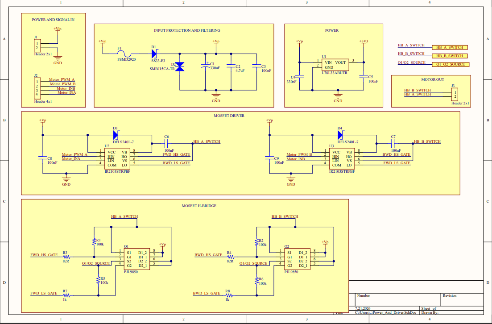
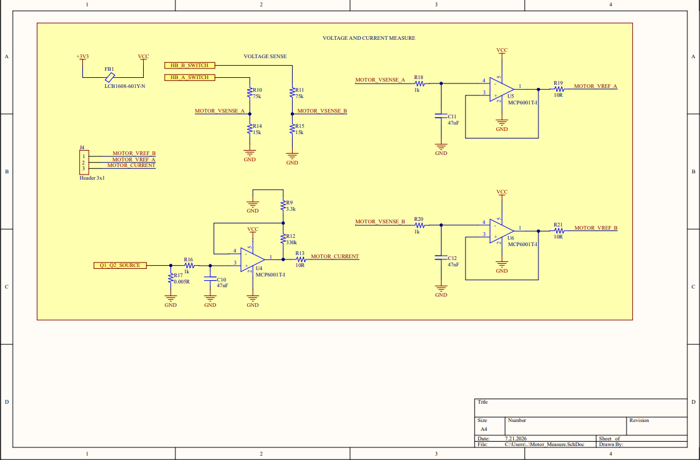
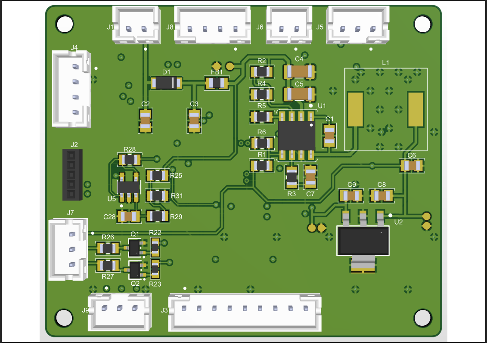
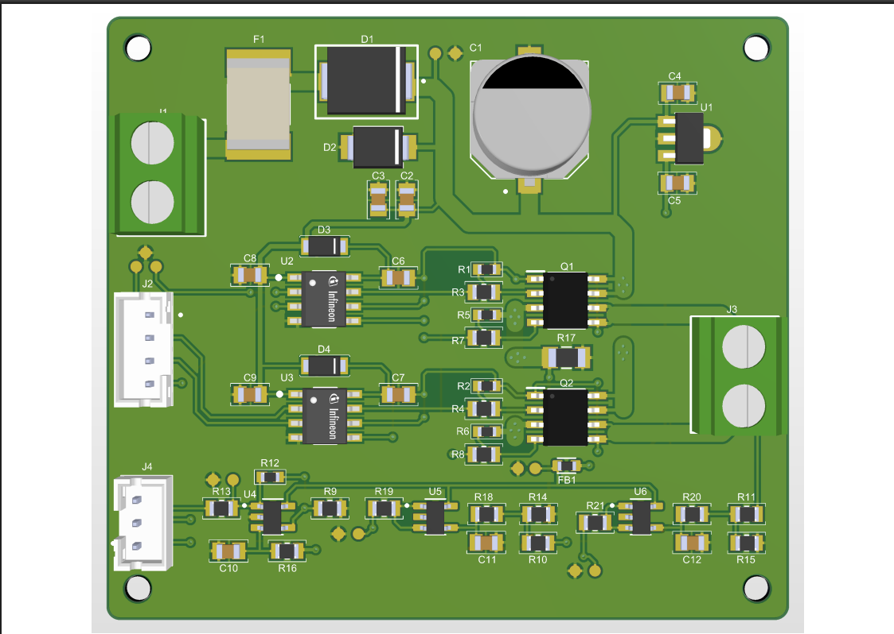

# Otomatik Tavuk Kümesi Kapısı Donanım Tasarımı

Bu sunum, **STM32F103C8T6 tabanlı otomatik tavuk kümesi kapısı kontrol sistemi** için hazırlanmış donanım tasarım dosyalarını içerir.

Sistem; Li-ion pil paketi ile beslenen ana kontrol kartı ve fırçalı DC motoru süren motor kontrol kartından oluşur. Ana kontrol kartı; kapı konumunu limit switch ile takip eder, IR sensör ile varlık algılar, TFT ekran, panel LED'leri ve panel butonları üzerinden kullanıcı arayüzünü yönetir. Motor kontrol kartı ise ana karttan gelen PWM/yön kontrol sinyalleriyle 12 V DC motoru sürer ve motor akım/gerilim geri bildirimlerini ana karta gönderir.

> Bu sunum ağırlıklı olarak PCB donanım tasarım dosyalarını içerir. Firmware/yazılım geliştirmesi buraya dahil değildir.

---

## Proje Özeti

Sistem ana beslemesini **Li-ion pil paketinden** alır. Ana kart üzerinde gerekli gerilim seviyelerini üretmek için güç dönüştürücü devreler bulunur. Motor sürüş işlemi ise ayrı tasarlanan **Automatic Door Motor Control Board** üzerinden gerçekleştirilir.

Sistemde bulunan temel donanımlar:

- **Li-ion pil paketi ana besleme girişi**
- **12 V → 5 V buck converter güç katı**
- **5 V → 3.3 V LDO regülatör güç katı**
- **STM32F103C8T6 mikrodenetleyici**
- **Harici 8 MHz HSE kristal**
- **Harici 32.768 kHz LSE kristal**
- **TFT ekran arayüzü**
- **Motor PWM ve yön kontrol çıkışları**
- **12 V DC worm gear motor sürüş katı**
- **Motor akım geri bildirimi**
- **Motor gerilim geri bildirimi**
- **Kullanıcı buton girişleri**
- **Panel durum LED çıkışları**
- **Düşük pil algılama devresi**
- **IR varlık/engel sensörü girişi**
- **Kapı tam açık / tam kapalı limit switch girişleri**
- **SWD programlama ve debug bağlantısı**
- **Ana besleme hatları için test point'ler**

Genel sistem bağlantısı:

```text
Main Board → PWM / Control Signals → Motor Control Board → DC Motor
                         ↑
              Motor Voltage / Current Feedback
```

---

## Donanım Blokları

### Güç Devresi

Kartın ana beslemesi Li-ion pil paketidir. Giriş gerilimi önce buck converter ile 5 V seviyesine düşürülür. Ardından 5 V hattından LDO regülatör ile 3.3 V lojik besleme hattı üretilir.

| Hat | Kaynak | Kullanım Amacı |
|---|---|---|
| Pil Girişi | Li-ion pil paketi | Ana sistem beslemesi |
| 5 V | Buck converter | Sensör/periferik beslemesi |
| 3.3 V | LDO regülatör | MCU ve lojik devre beslemesi |

Güç bölümünde giriş filtreleme, koruma elemanları ve regüle çıkış devreleri bulunmaktadır.


---

### Mikrodenetleyici Bölümü

Ana kontrolcü olarak **STM32F103C8T6** kullanılmıştır.

MCU bölümünde bulunan temel yapılar:

- STM32F103C8T6 mikrodenetleyici
- Harici 8 MHz HSE kristal
- Harici 32.768 kHz LSE kristal
- MCU besleme dekuplaj kapasitörleri
- Reset / boot bağlantıları
- SWD programlama ve debug header'ı
- 3.3 V lojik besleme bağlantıları


---

### Harici Donanım Arayüzleri

Ana kontrol kartı, otomatik kapı sisteminde kullanılan harici donanımlar için gerekli bağlantı ve kontrol arayüzlerini içerir.

Desteklenen harici bağlantılar:

- TFT ekran bağlantısı
- Motor kontrol kartına PWM ve yön sinyalleri
- Motor akım/gerilim geri bildirim girişleri
- Kullanıcı buton girişleri
- Panel durum LED çıkışları
- IR varlık/engel sensörü girişi
- Kapı tam açık/tam kapalı limit switch girişi
- Pil/düşük gerilim algılama sinyalleri


---

### Motor Control Board 

Motor Control Board, 12 V fırçalı DC motorun çift yönlü ve PWM kontrollü sürülmesi için ana kontrol kartından ayrı bir güç kartı olarak tasarlanmıştır. Kart yaklaşık **60 mm x 53 mm** boyutundadır ve dört adet montaj deliğine sahiptir.

Kartın temel bölümleri:

- Girişte resetlenebilir PTC sigorta, seri Schottky diyot ve SMBJ15CA TVS koruması
- 330 uF bulk kapasitör ile giriş filtreleme
- İki adet IR2103 yarım-köprü gate driver
- İki adet PJL9850 çift N-kanal MOSFET ile oluşturulan tam H-köprü
- Motorun çift yönlü sürülmesi ve PWM ile hız kontrolü
- 5 mOhm şönt direnç ve MCP6001 op-amp ile motor akım ölçümü
- Motorun iki terminali için gerilim bölücü, RC filtre ve MCP6001 buffer devreleri
- Ölçüm devreleri için filtrelenmiş 3.3 V analog besleme
- Ana kontrol kartına üç analog geri bildirim çıkışı

#### Motor Kontrol Sinyalleri

| Sinyal | Açıklama |
| --- | --- |
| `Motor_PWM_A` | A yarım-köprüsü PWM kontrolü |
| `Motor_PWM_B` | B yarım-köprüsü PWM kontrolü |
| `Motor_INA` | A yarım-köprüsü yön/alt anahtar kontrolü |
| `Motor_INB` | B yarım-köprüsü yön/alt anahtar kontrolü |

#### Ölçüm ve Geri Bildirim Sinyalleri

| Sinyal | Açıklama |
| --- | --- |
| `MOTOR_CURRENT` | Şönt direnç üzerinden yükseltilmiş motor akım ölçümü |
| `MOTOR_VREF_A` | Motorun A terminaline ait ölçeklendirilmiş gerilim |
| `MOTOR_VREF_B` | Motorun B terminaline ait ölçeklendirilmiş gerilim |

Bu geri bildirimler, yazılım tarafında motor akımının izlenmesi, sıkışma/stall durumunun belirlenmesi ve motor uç gerilimlerinden hareket bilgisinin değerlendirilmesi için kullanılacaktır.

#### Motor Güç ve Sürücü Şematiği



#### Motor Ölçüm Şematiği



---

### Motor Driver Topology

Motor sürüş katı, **4 adet N-channel MOSFET** ile oluşturulmuş high-side / low-side **H-bridge** yapısına sahiptir. MOSFET'ler iki adet half-bridge MOSFET driver ile sürülür.

Kullanılan temel sürüş mantığı:

| Çalışma Durumu | PWM_A | IN_A | PWM_B | IN_B |
|---|---|---|---|---|
| Forward | Active | Active | Passive | Passive |
| Reverse | Passive | Passive | Active | Active |
| Stop | Passive | Passive | Passive | Passive |

Bu yapı sayesinde motor yön kontrolü ve PWM tabanlı hız/enerji kontrolü ana kart üzerinden gerçekleştirilebilir.

### Input Protection and Filtering

Motor kontrol kartının giriş bölümünde güç hattını korumak ve filtrelemek için aşağıdaki yapılar bulunur:

- PTC resettable fuse
- Reverse polarity protection Schottky diode
- TVS diode
- Bulk input capacitor
- MLCC input filter capacitors

Bu bölüm, motor kartının giriş beslemesini ters bağlantı, ani gerilim darbeleri ve besleme hattı gürültülerine karşı daha dayanıklı hale getirmek için tasarlanmıştır.

### Motor Current Sensing

Motor akımı low-side shunt direnç üzerinden ölçülür. Shunt üzerinde oluşan düşük seviyeli voltaj, op-amp tabanlı sinyal koşullandırma devresiyle ana karta uygun ölçüm sinyali haline getirilir.

Bu geri bildirim aşağıdaki amaçlarla kullanılabilir:

- Motor yük durumunun izlenmesi
- Sıkışma / stall durumunun algılanması
- Aşırı akım durumlarının yazılımsal olarak takip edilmesi
- Motor hareketinin güvenlik açısından denetlenmesi

### Motor Voltage Sensing

Motorun her iki terminali (`HB_A_SWITCH` ve `HB_B_SWITCH`) ayrı ayrı ölçülmektedir. Terminal gerilimleri, 75 kΩ / 15 kΩ gerilim bölücüler ile yaklaşık **1/6 oranında düşürülerek** `MOTOR_VSENSE_A` ve `MOTOR_VSENSE_B` sinyallerine dönüştürülür.

Bu sinyaller, 1 kΩ direnç ve 47 nF kondansatörden oluşan giriş filtresinden geçirildikten sonra MCP6001 op-amp'ları tarafından gerilim takipçisi (unity-gain buffer) olarak tamponlanır. Böylece gerilim bölücü devresi ADC girişinden izole edilir ve ana karta daha kararlı, düşük empedanslı ölçüm sinyalleri iletilir.

Motor gerilim geri bildirim sinyalleri:

- `MOTOR_VREF_A`
- `MOTOR_VREF_B`

Ana kart, bu iki geri bildirim sinyali arasındaki farkı kullanarak motor uçları arasındaki gerçek gerilimi hesaplayabilir.

Motor akım geri bildirim sinyali:

- `MOTOR_CURRENT`

### Main Board Interface

Motor kontrol kartı ana karta aşağıdaki sinyaller üzerinden bağlanır:

| Sinyal | Yön | Açıklama |
|---|---|---|
| `Motor_PWM_A` | Main Board → Motor Control Board | A yönü PWM kontrol sinyali |
| `Motor_INA` | Main Board → Motor Control Board | A yönü enable/direction kontrol sinyali |
| `Motor_PWM_B` | Main Board → Motor Control Board | B yönü PWM kontrol sinyali |
| `Motor_INB` | Main Board → Motor Control Board | B yönü enable/direction kontrol sinyali |
| `MOTOR_VREF_A` | Motor Control Board → Main Board | Motor A terminali gerilim geri bildirimi |
| `MOTOR_VREF_B` | Motor Control Board → Main Board | Motor B terminali gerilim geri bildirimi |
| `MOTOR_CURRENT` | Motor Control Board → Main Board | Motor akım geri bildirimi |


### PCB Design

Motor kontrol kartı **2-layer PCB** olarak tasarlanmıştır. Kart üzerinde motor akımı taşıyan güç yolları geniş tutulmuş, GND dönüş yolu için polygon pour yapısı kullanılmıştır. Motor akımı, motor gerilimi ve sürücü kontrol sinyalleri ayrı izleme/geri bildirim hatları olarak ana karta taşınır.

---

## PCB Görünümleri

### Main Board - PCB Üst Görünüm



### Main Board - PCB Alt Görünüm


### Motor Control Board - PCB Üst Görünüm



---

## Dosya Yapısı

```text
.
├── Design_Files/
│   ├── Chicken_Coop_Door_Main_Board_V3.PcbDoc
│   ├── Chicken_Coop_Door_Main_Board_V3.PrjPcb
│   ├── Chicken_Coop_Door_Main_Board_V3.PrjPcbStructure
│   ├── Power.SchDoc
│   ├── MCU.SchDoc
│   ├── External_Hardware.SchDoc
│   ├── Chicken_Coop_Door_Motor_Control_Board_V2.PrjPcb
│   ├── Chicken_Coop_Door_Motor_Control_Board_V2.PrjPcbStructure
│   ├── Chicken_Coop_Door_Motor_Control_Board_V2.PcbDoc
│   └── Power_And_Driver.SchDoc
│   └── Motor_Measure.SchDoc
│
├── Images/
│   ├── Power.png
│   ├── MCU_Schematic.png
│   ├── External_Hardware_Schematic.png
│   ├── Motor_Control_Board_Power_And_Driver_Schematic.png
│   ├── Motor_Control_Board_Motor_Measure_Schematic.png
│   ├── PCB_Top_View.png
│   ├── PCB_Bottom_View.png
│   ├── Motor_Control_Board_3D_Top.png
│
├── Production/
│   ├── Bill of Materials-Chicken_Coop_Door_Main_Board_V3.xlsx
│   └── Bill of Materials-Chicken_Coop_Door_Motor_Control_Board_V2.xlsx
│
└── README.md
```

---

## Tasarım Dosyaları

PCB tasarımları **Altium Designer** kullanılarak hazırlanmıştır.

Sunumda bulunan temel Altium dosyaları:

| Dosya | Açıklama |
|---|---|
| `Chicken_Coop_Door_Main_Board_V3.PrjPcb` | Ana kontrol kartı Altium PCB proje dosyası |
| `Chicken_Coop_Door_Main_Board_V3.PcbDoc` | Ana kontrol kartı PCB layout dosyası |
| `Power.SchDoc` | Ana kontrol kartı güç devresi şematik dosyası |
| `MCU.SchDoc` | Mikrodenetleyici devresi şematik dosyası |
| `External_Hardware.SchDoc` | Harici donanım arayüzleri şematik dosyası |
| `Chicken_Coop_Door_Main_Board_V3.PrjPcbStructure` | Ana kontrol kartı Altium proje yapı dosyası |
| `Chicken_Coop_Door_Motor_Control_Board_V2.PrjPcb` | Motor kontrol kartı Altium PCB proje dosyası |
| `Chicken_Coop_Door_Motor_Control_Board_V2.PcbDoc` | Motor kontrol kartı PCB layout dosyası |
| `Power_And_Driver.SchDoc` | Motor kontrol kartı şematik dosyası |
| `Motor_Measure.SchDoc` | Motor kontrol kartı şematik dosyası |

---

## Malzeme Listesi

BOM dosyaları `Production` klasörü altında yer almaktadır:

```text
Production/Bill of Materials-Chicken_Coop_Door_Main_Board_V3.xlsx
Production/Bill of Materials-Chicken_Coop_Door_Motor_Control_Board_v2.xlsx
```

Bu dosyalar, projede kullanılan komponentleri, değerleri, üretici bilgilerini ve footprint bilgilerini içerir.

---

## Ana Fonksiyonel Bölümler

### 1. Pil Girişi ve Güç Regülasyonu

Kartın ana beslemesi, seri bağlı Li-ion hücrelerden oluşan pil paketi üzerinden sağlanacak şekilde tasarlanmıştır. Pil gerilimi buck converter devresi ile 5 V seviyesine düşürülür. Ardından 5 V hattından LDO regülatör ile 3.3 V lojik besleme hattı elde edilir.

### 2. MCU Kontrol Bölümü

STM32F103C8T6 mikrodenetleyici aşağıdaki işlemleri yönetmek için kullanılır:

- Kapı motor kontrol komutlarının üretilmesi
- Kullanıcı butonlarının okunması
- TFT ekran arayüzü
- Sensör ve limit switch girişlerinin okunması
- Pil durumunun takip edilmesi
- Panel LED çıkışlarının kontrol edilmesi
- Motor akım/gerilim geri bildirimlerinin değerlendirilmesi

### 3. Motor Kontrol Arayüzü

Ana kontrol kartı motor güç katını doğrudan üzerinde taşımaz. Bunun yerine **Automatic Door Motor Control Board** kartına PWM ve yön kontrol sinyalleri gönderir. Motor kontrol kartı bu sinyallerle H-bridge güç katını sürer ve motoru ileri/geri yönde çalıştırır.

### 4. Motor Sürüş ve Geri Bildirim Bölümü

Motor kontrol kartı üzerinde 12 V DC motoru süren H-bridge güç katı, MOSFET driver devreleri, giriş koruma/filtreleme yapısı, motor akım ölçüm devresi ve motor gerilim ölçüm devreleri bulunur.

Bu yapı sayesinde motor sürüşü ana karttan fiziksel olarak ayrılır ve motorun elektriksel davranışı geri bildirim sinyalleri ile izlenebilir.

### 5. Kullanıcı Arayüzü

Kullanıcı arayüzü için ana kart üzerinde aşağıdaki bağlantılar yer alır:

- TFT ekran bağlantısı
- Kullanıcı butonları
- Panel durum LED çıkışları

Bu arayüzler, sistem durumunun görüntülenmesi ve kullanıcıdan manuel komut alınması için kullanılır.

### 6. Sensör ve Geri Bildirim Girişleri

Kart üzerinde kapı hareketini ve çevresel koşulları takip etmek için çeşitli girişler bulunur:

- IR varlık sensörü
- Kapı tam açık - kapalı limit switch'i
- Düşük pil algılama girişi
- Motor akım geri bildirimi
- Motor gerilim geri bildirimi

Bu sinyaller, kapı hareketinin güvenli ve kontrollü şekilde yönetilmesini sağlar.

---

## Yazar

**Hüseyin Yanar**

Elektrik-Elektronik Mühendisi
